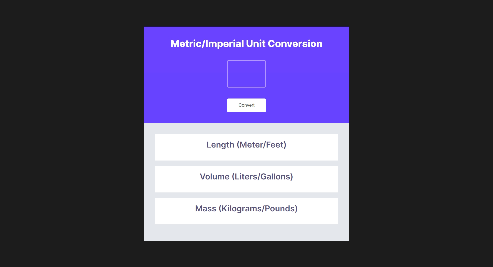

# Scrimba - Solo Project - Unit converter

This is a solution to [Scrimba - Solo Project - Unit converter](https://scrimba.com/playlist/pDgg5fd) challenge found in JavaScript challenges - part 3 for Module 3 of The Frontend Developer Career Path.

## About Scrimba

At Scrimba our goal is to create the best possible coding school at the cost of a gym membership! 💜
If we succeed with this, it will give anyone who wants to become a software developer a realistic shot at succeeding, regardless of where they live and the size of their wallets 🎉
The Frontend Developer Career Path aims to teach you everything you need to become a Junior Developer, or you could take a deep-dive with one of our advanced courses 🚀

- [Our courses](https://scrimba.com/allcourses)
- [The Frontend Career Path](https://scrimba.com/learn/frontend)
- [Become a Scrimba Pro member](https://scrimba.com/pricing)

Happy Coding!

## Table of contents

- [Scrimba - Solo Project - Unit converter](#scrimba---solo-project---unit-converter)
  - [About Scrimba](#about-scrimba)
  - [Table of contents](#table-of-contents)
  - [Overview](#overview)
    - [The challenge](#the-challenge)
    - [Screenshot](#screenshot)
    - [Links](#links)
  - [My process](#my-process)
    - [Built with](#built-with)
  - [Author](#author)

## Overview

### The challenge

Requirements:
- Follow the design spec provided via Figma file
- Generate all conversions when the user clicks "Convert"
- Round the numbers down to three decimal places

### Screenshot

### Links

- Solution URL: [Github Repo](https://github.com/varonalearns/Chrome-Extension)
- Live Site URL: [Netlify Live Site](https://regal-scone-3b8ca1.netlify.app/)

## My process

### Built with

- Semantic HTML5 markup
- CSS custom properties
- Flexbox
- Vanilla JavaScript

## Author

- Website - [Evalia Varona](https://www.evaliavarona.com)
- Hashnode - [@evavarona](https://evaliavarona.hashnode.dev)